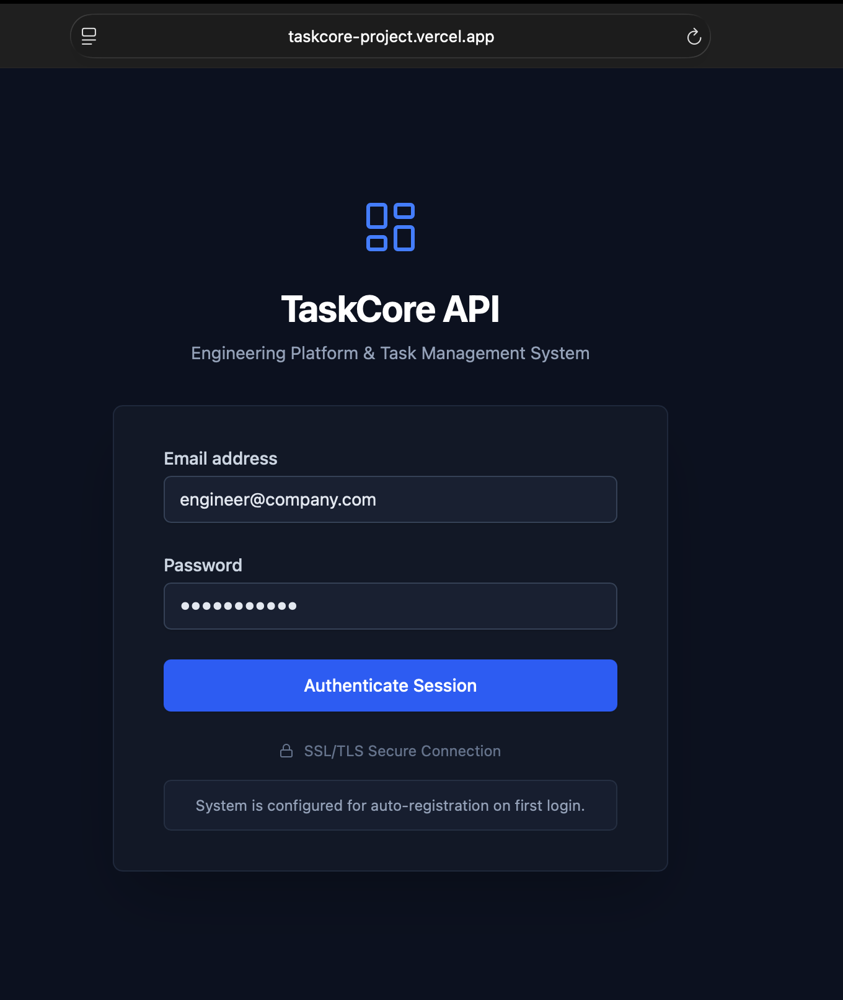
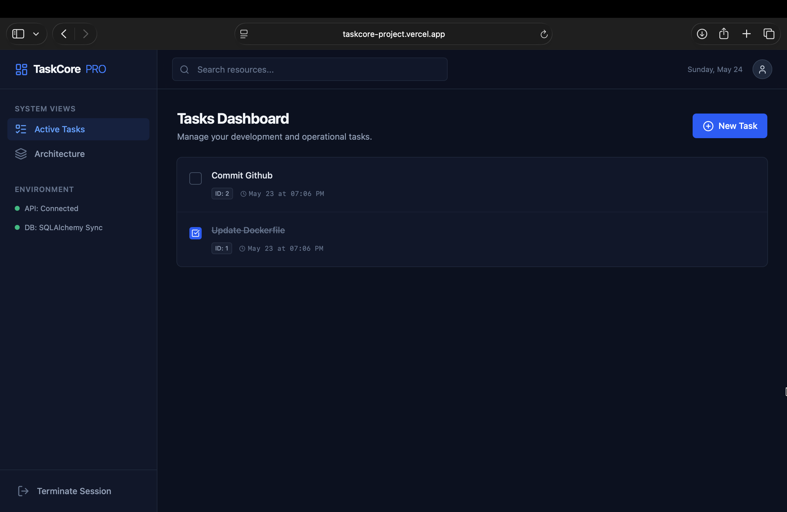
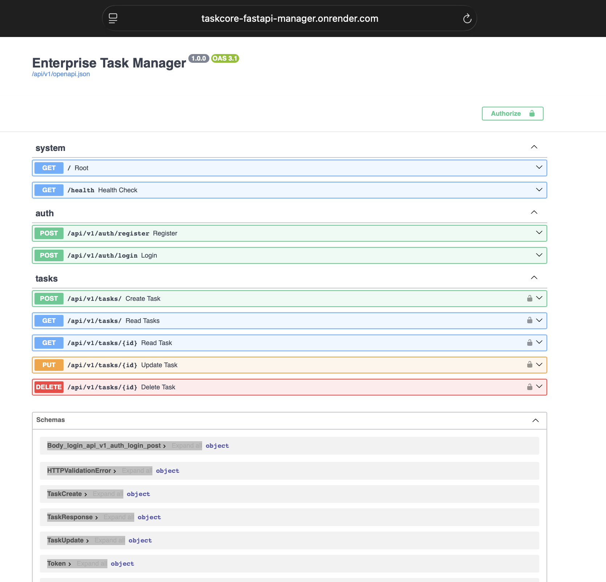

# 🚀 TaskCore PRO

TaskCore PRO is a full-stack task management application built using FastAPI, React, SQLAlchemy, JWT authentication, and Docker.

The application allows users to:

- Register and login securely
- Create, update, complete, and delete tasks
- View only their own tasks
- Interact with a responsive frontend connected to a FastAPI backend

This project was built as part of a Python Developer Intern assessment.

---

# 📌 Features

## Authentication

- User Registration
- User Login
- JWT Authentication
- Password Hashing using bcrypt

## Task Management

- Create Tasks
- View All Tasks
- View Single Task
- Update Task Status
- Delete Tasks
- Pagination Support
- Task Filtering (`?completed=true`)

## Frontend

- React + Vite frontend
- Responsive UI
- Connected to FastAPI backend using Axios

## Backend

- FastAPI REST API
- SQLAlchemy ORM
- Pydantic Validation
- Alembic Migration Setup
- Pytest Test Structure
- Dockerized Setup

---

# 🏗 Project Structure

```bash
.
├── backend/
│   ├── alembic/
│   ├── tests/
│   ├── app/
│   │   ├── api/
│   │   ├── core/
│   │   ├── db/
│   │   ├── models/
│   │   ├── schemas/
│   │   └── main.py
│   ├── requirements.txt
│   └── Dockerfile
├── src/
├── Dockerfile.frontend
└── docker-compose.yml
```

---

# ⚙️ Tech Stack

## Backend

- FastAPI
- SQLAlchemy
- SQLite
- Alembic
- Pydantic V2
- PyJWT
- Passlib bcrypt

## Frontend

- React
- TypeScript
- Vite
- Axios

## DevOps

- Docker
- Docker Compose

---

# 🔐 Security Features

- Passwords are hashed using bcrypt
- JWT-based authentication
- Protected API routes
- User-specific task access control
- Environment variable configuration

---

# 🧪 API Endpoints

## Authentication

| Method | Endpoint | Description |
|---|---|---|
| POST | `/api/v1/auth/register` | Register user |
| POST | `/api/v1/auth/login` | Login user |

## Tasks

| Method | Endpoint | Description |
|---|---|---|
| GET | `/api/v1/tasks/` | Get all tasks |
| POST | `/api/v1/tasks/` | Create task |
| GET | `/api/v1/tasks/{id}` | Get single task |
| PUT | `/api/v1/tasks/{id}` | Update task |
| DELETE | `/api/v1/tasks/{id}` | Delete task |

---

# 🚀 Running Locally

## Prerequisites

- Docker Desktop installed
- Git installed

## Clone Repository

```bash
git clone https://github.com/Pavi1906/taskcore-fastapi-manager.git

cd taskcore-fastapi-manager
```

## Start Application

```bash
docker compose up --build
```

---

# 🌐 Available Services

| Service | URL |
|---|---|
| Frontend | http://localhost:3000 |
| Swagger Docs | http://localhost:8000/docs |

---

# 🌍 Deployment Links

| Service | URL |
|---|---|
| Frontend Deployment | https://taskcore-project.vercel.app |
| Backend API | https://taskcore-fastapi-manager.onrender.com |
| Swagger Docs | https://taskcore-fastapi-manager.onrender.com/docs |

---

# 📸 Screenshots

## Login Page    



## Dashboard



## Swagger API Docs



---
  
# 🧪 Running Tests

```bash
cd backend

pip install -r requirements.txt

pytest -v
```

---

# 🔧 Environment Variables

Create a `.env` file inside the `backend` directory:

```env
DATABASE_URL=sqlite:////app/data/sql_app.db
SECRET_KEY=CHANGE_THIS_SECRET_KEY
ACCESS_TOKEN_EXPIRE_MINUTES=60
```

---

# 📦 Docker Support

The project includes:

- Backend Dockerfile
- Frontend Dockerfile
- Docker Compose orchestration

Run the complete application using:

```bash
docker compose up --build
```

---

# 📄 Assignment Requirements Covered

- FastAPI Backend
- JWT Authentication
- Password Hashing
- SQLite Database
- SQLAlchemy ORM
- Pydantic Models
- Proper Folder Structure
- React Frontend
- CRUD Operations
- Pagination
- Filtering
- Dockerfile
- Responsive UI
- Pytest Structure
- `.env.example` Included
- Frontend & Backend Separation

---

# 🚀 Future Improvements

- PostgreSQL deployment
- CI/CD pipeline
- Role-based authentication
- Redis caching
- Async background jobs
- Task priority & due dates

---

# 👩‍💻 Author

**Pavithra P**

GitHub:  
https://github.com/Pavi1906

---

# 📄 License

This project is intended for educational and internship evaluation purposes.

---
